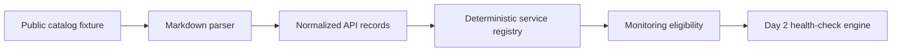

# API Support Operations Lab

An AI-automation portfolio project that turns a public API catalog into a monitored service registry, operational incidents, and a decision-ready support dashboard.

> Day 1 uses public metadata from the community-maintained [public-apis catalog](https://github.com/public-apis/public-apis). The committed excerpt is a deterministic fixture for demonstrating the engineering workflow; it is not a live availability claim.

## Business question

Which external APIs are suitable for monitored workflows, and how should an operations team detect, classify, prioritize, and explain service failures?

The eventual decision owner is an automation or data-platform lead responsible for choosing dependencies and responding when an upstream service becomes unreliable.

## Day 1 build status

The repository currently:

- parses Markdown API tables into typed records;
- normalizes authentication, HTTPS, and CORS metadata;
- assigns stable category-and-name registry identifiers;
- identifies no-auth HTTPS services eligible for controlled monitoring;
- writes deterministic CSV and JSON artifacts; and
- tests parsing, normalization, deduplication, and byte-for-byte reproducibility.

No external endpoints are called on Day 1. Live health checks begin on Day 2 with a small, respectful target list.

## Quick start

```bash
python3 -m venv .venv
source .venv/bin/activate
pip install -r requirements.txt
make test
make run
```

Generated outputs are written to `artifacts/`:

- `api_registry.csv` — analyst-friendly service registry;
- `api_registry.json` — typed machine-readable registry; and
- `registry_summary.json` — category, authentication, and monitoring-readiness metrics.

## Decision flow



## Five-day roadmap

1. **Catalog foundation:** parser, registry, deterministic fixtures, tests
2. **Health monitoring:** latency history, failure handling, controlled endpoint probes
3. **Incident operations:** incident model, severity rules, automated tests
4. **AI evaluation:** failure classification, evaluation harness, cost tracking
5. **Decision experience:** executive dashboard, CI, GitHub Pages deployment

## Repository map

```text
src/api_support_operations/  catalog parsing and registry pipeline
data/                        attributed deterministic catalog fixture
tests/                       parser and reproducibility tests
artifacts/                   generated registry outputs
docs/                        data contract and operating assumptions
```

## Responsible-use guardrails

- The catalog is a discovery source, not proof that an API is currently available.
- Provider documentation remains authoritative for authentication, usage, and rate limits.
- Future monitoring will use a small allowlist, descriptive user agent, bounded timeouts, and low request frequency.
- No employer, customer, credential, or private operational data belongs in this repository.

## Current limitations

- The Markdown parser supports the table structure used by the catalog fixture; unusual embedded pipe characters require escaping.
- Monitoring eligibility currently means no authentication plus HTTPS support. Day 2 will add explicit endpoint and policy review.
- CORS is retained as metadata but does not determine server-side monitoring eligibility.

## License

MIT. The source catalog has its own [MIT license](https://github.com/public-apis/public-apis/blob/master/LICENSE).

