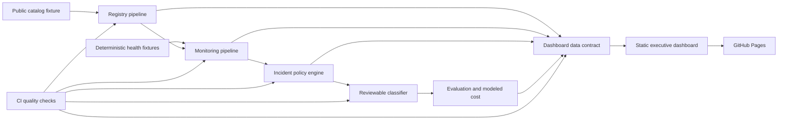

# Day 5 decision experience, architecture, and interview walkthrough

Day 5 turns the deterministic registry, monitoring, incident, and classification artifacts into a public decision experience. The dashboard is intentionally static: it can be hosted on GitHub Pages, has no credential or backend requirement, and cannot trigger operational actions.

## Decision experience

The dashboard answers five executive questions in sequence:

1. **What is in scope?** Registry coverage shows catalog size and monitoring eligibility.
2. **What happened?** The service-health view summarizes bounded fixture observations and latency history.
3. **How serious was it?** The incident queue exposes severity, failure category, owner, confidence, and lifecycle state.
4. **Where does automation stop?** The AI panel reports evaluation coverage, accuracy on answered cases, macro F1, threshold, and review volume.
5. **What did it cost?** The cost card shows the explicitly modeled batch amount without presenting it as an invoice, saving, or return on investment.

Every dashboard value is generated by `api_support_operations.dashboard` from committed artifacts. The web layer formats and filters the payload; it does not recalculate business rules.

## Architecture

### Repository map

| Area | Responsibility |
|---|---|
| `src/api_support_operations/` | Registry, monitoring, incident, classification, evaluation, and dashboard-data pipelines |
| `config/` | Reviewed monitoring, incident, ownership, confidence, and modeled-pricing policies |
| `data/` | Attributed catalog excerpt and deterministic operational/evaluation fixtures |
| `artifacts/` | Auditable machine-readable outputs from Days 1–4 |
| `site/` | Responsive static dashboard, social preview, and generated dashboard data contract |
| `tests/` | Policy, resilience, evaluation, dashboard, and reproducibility tests |
| `.github/workflows/` | Continuous integration and GitHub Pages deployment |

## Delivery and consistency controls

The quality workflow compiles the Python source, runs the complete deterministic pipeline and test suite, checks whitespace, and fails if regenerated artifacts or dashboard data differ from the committed versions.

The Pages workflow repeats the full pipeline and drift check before it packages only `site/`. Its deployment job uses the minimum required `pages: write` and `id-token: write` permissions. The dashboard therefore cannot publish if tests or reproducibility checks fail.

## Responsible-use boundary

- Catalog inclusion and computed eligibility are discovery signals, never authorization to probe an endpoint.
- Live monitoring remains separate, opt-in, and bounded by the reviewed allowlist and minimum interval.
- Fixture health, latency, severity, criticality, and ownership do not represent provider-wide performance or customer impact.
- The classifier is an offline structured-rules baseline behind a provider-agnostic boundary; it does not prove general language-model quality.
- Evaluation labels are synthetic and deliberately small. Accuracy and macro F1 are regression evidence, not production performance.
- Human review remains authoritative when confidence is low, the category is unknown, or routing fields are invalid.
- Token and cost values are modeled under illustrative rates. The project claims neither realized spend nor realized savings.
- No credential, private response body, customer record, or employer data belongs in the repository or dashboard.

## Five-minute interview walkthrough

### 0:00–0:45 — Frame the problem

“External APIs are hidden dependencies in automated workflows. I built a five-day operating system that moves from discovery to controlled monitoring, incident decisions, AI-assisted triage, and an executive dashboard—without relying on private data or paid API calls.”

### 0:45–1:30 — Establish the control boundary

Show the registry and monitoring-ready percentage. Explain that a public catalog is useful for discovery, but it is not authorization. Only three exact endpoints enter the reviewed monitoring allowlist, and live checks remain deliberate and rate-limited.

### 1:30–2:20 — Demonstrate resilience and evidence

Open the service-health cards and incident queue. Explain the stable failure taxonomy, preserved latency history, deterministic incident identities, evidence timeline, recovery state, severity policy, and bounded recommended actions. Emphasize that one target failing never stops the remaining checks.

### 2:20–3:20 — Explain the AI design

Use the AI panel to discuss the provider-agnostic classifier, prompt/version provenance, confidence threshold, abstention, and human-review path. The committed provider is an offline baseline so tests are reproducible and require no credential. The interface could later accept a model adapter without weakening validation or review controls.

### 3:20–4:10 — Read the metrics honestly

At the reviewed threshold, the synthetic fixture suite reports 90.91% coverage, 100% accuracy on answered cases, and 0.96 macro F1. State immediately that this is a small regression suite—not a production benchmark. The modeled six-incident batch cost is displayed as an assumption, not an invoice or savings claim.

### 4:10–5:00 — Close with delivery discipline

Show the workflows and repository map. Explain that every public metric is regenerated from committed evidence, CI fails on output drift, and Pages deploys only after the complete pipeline and tests pass. Close with the business value: faster, more consistent triage with a visible human decision boundary.
